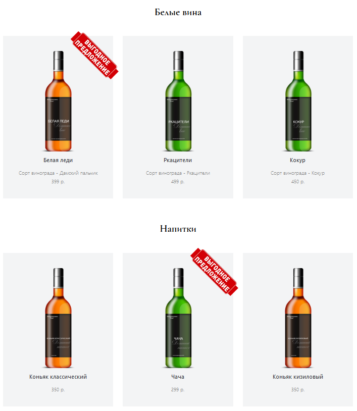

# Новое русское вино

Сайт магазина авторского вина "Новое русское вино".

## Фронт проекта

Одностраничный сайт с каталогом напитков разбитых по категориям.

## Данные

Данные для каталога парсятся из `.xlsx` файла.

Пример файла можно найти в папке `files/wine.xlsx`

Можно использовать свой файл при запуске программы с помощью команды
`-f path/example.xlsx`

Или указать путь до файла в `.env` как `FILE_PATH=path/example.xlsx`

Таблица должна иметь следующие обязательные поля.

|   category   |        title        |    wine_sort    | price |          picture         |       sale_out       |
|:------------:|:-------------------:|:---------------:|:-----:|:------------------------:|:--------------------:|
| Белые вина   | Белая леди          | Дамский пальчик | 399   | belaya_ledi.png          | Выгодное предложение |
| Напитки      | Коньяк классический |                 | 350   | konyak_klassicheskyi.png |                      |
| Красные вина | Черный лекарь       | Качич           | 399   | chernyi_lekar.png        |                      |

## Запуск

- Скачайте код
- Запустите сайт командой `python3 main.py`
- Перейдите на сайт по адресу [http://127.0.0.1:8000](http://127.0.0.1:8000).

## Используемые библиотеки

* [Jinja2](https://pypi.org/project/Jinja2/) - шаблонизация
* pandas - чтение данных из .xlsx файла
* [xlrd](https://pypi.org/project/xlrd/) - работа с .xlsx файлами

## Цели проекта

Код написан в учебных целях — это урок в курсе по Python и веб-разработке на сайте [Devman](https://dvmn.org).
